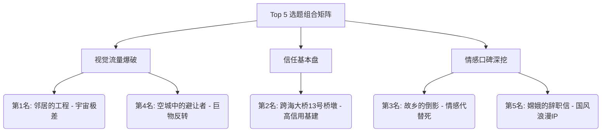

1.

我对四位 AI 针对同一提示词输出的 **96 个开放主题**及 **40 个高潜力主题卡**进行了深度对照、逻辑解构与交叉评估，结合《统一内容爆款战略底座》中的 **入口信用、求证递进、视觉发动机、情绪回报与 AI 落地可控性** 五大核心维度，为你整理出这份整合分析与**目前最高价值、最值得优先制作的前 5 名选题方案**。

---

### 一、 四家 AI 输出的特质与视角拆解

| AI 来源 | 核心叙事风格 | 主要优势 | 潜在短板 |
| :--- | :--- | :--- | :--- |
| **AI 1** | **高概念奇观与柔软情感** | 概念极具想象力（如海啸悬停、嫦娥辞职），摆脱单纯恐惧，注重文明与情感回报。 | 部分场景（如悬空海水物理态）对 AI 视觉连续性要求极高。 |
| **AI 2** | **高信用基建与东方史诗** | 锚定大国基建与历史古迹（如桥墩齿轮、长城军牌），现实信用极强，AI 生成控制力高。 | 偏向硬核工程与考古质感，需要刻意注入人性情绪线。 |
| **AI 3** | **日常错位与中式伦理** | 极度擅长将都市怪谈转化为中式温情与命运悲怆（如棺木新衣、避让巨物）。后劲极大。 | 部分选题偏向生活细微处，需要精细的视觉镜头设计。 |
| **AI 4** | **宏大极差与沧桑记忆** | 强调极日常与极宏大的视觉反差（如阳台看施工环），桃源与冷战历史沧桑感强。 | 抽象概念较多，需防范文案过度说教或流于静态抒情。 |

---

### 二、 最高价值目前最值得做的 Top 5 选题（综合整合版）

经过多轮筛选与互补优化，选出的 Top 5 组合覆盖了 **【宇宙极差】、【高信用基建】、【中式伦理情感】、【巨物反转】与【国风科幻 IP】** 五种完全不同的爆款生态位，兼顾了高曝光突破与高粉丝粘性。

---

#### 🥇 第 1 名：《邻居的工程》
> **整合来源**：AI 4 主题 1 / AI 1 主题 11 升级版  
> **赛道定位**：宇宙奇观与日常极差（爆款破圈级）

* **一句话故事种子**：
  34岁公寓住户某天清晨推开阳台窗户，发现天空中出现一座正在缓慢自我构建的太阳系级巨型工业结构，比例远超人类认知，且它似乎在朝地球方向持续靠近。
* **用户最想看什么**：
  一个不可能的宇宙尺度施工奇观，如何一步步侵入最普通的日常生活场景（晾衣服、看早餐新闻）。
* **核心视觉发动机**：
  * `图1`：清晨阳台上晾着衣服，远处蓝天中赫然横跨着一道正在喷吐微光的巨型金属结构环。
  * `图2`：数天后，结构完成度提高，地面信号开始与天空结构产生电磁谐振，城市阴影被改变。
  * `图3`：住户通过望远镜观察到，结构交界处并非兵器，而是某种正在完工的“大气与磁场保护屏障”。
* **为什么排第 1 名**：
  **入口摩擦力为零，画面反差最大**。阳台日常与戴森球级工程并置，瞬间产生极强视觉冲击力，极易在社交平台引发“如果你推开窗看到这个会怎样”的爆发式转述。

---

#### 🥈 第 2 名：《跨海大桥第 13 号桥墩内部》
> **整合来源**：AI 2 高潜力主题 1  
> **赛道定位**：高信用现代基建与古代机械奇观（高信任基本盘）

* **一句话故事种子**：
  32岁桥梁维保工程师在对竣工十年的跨海大桥进行深度结构巡检时，进入封闭的第 13 号桥墩内部，在混凝土箱梁深处发现了一个咬合运转的古青铜齿轮轴心。
* **用户最想看什么**：
  现代宏大基建下方是否埋藏着未公开的古老机械系统，大桥每天通行数十万车流的真实用途究竟是什么。
* **核心视觉发动机**：
  * `图1`：繁忙的六车道跨海大桥雨夜全景 → 工程师顺着狭窄检修铁梯深入暗黑桥墩。
  * `图2`：工业手电照亮混凝土箱梁空腔，墙壁深处露出一座与桥墩同粗、表面刻满铭文的古代青铜齿轮。
  * `图3`：应力检测显示，上方车流的重力与震动，正在源源不断地为这套维持地壳稳定的地下机械提供动力。
* **为什么排第 2 名**：
  **现实信用极其坚固**。跨海大桥是所有人高度信任的锚点，“水泥+青铜”的材质对比极具美感，且 AI 生成控制难度极低，极易跑出高完播率。

---

#### 🥉 第 3 名：《故乡的倒影》
> **整合来源**：AI 3 高潜力主题 10  
> **赛道定位**：中式民俗伦理与父爱代代替死（极强情绪回报）

* **一句话故事种子**：
  35岁成年男子回乡为过世父亲迁坟，挖开棺木后发现里面没有遗骨，只有一套崭新合身、与自己今天身上穿的一模一样的同款黑色冲锋衣。
* **用户最想看什么**：
  父亲的棺材里为什么只有自己今天的衣服？这背后隐藏着何种跨越生死的隐秘牺牲。
* **核心视觉发动机**：
  * `图1`：雨后泥泞的乡村墓地，打开的木棺中没有腐朽白骨，正中央整齐叠着一件带吊牌的冲锋衣。
  * `图2`：男子震惊地对比自己身上的衣服，在棺内衣服的口袋里找到一张父亲手写的旧纸条：“替你挡了一劫，别再回村。”
  * `图3`：调查揭示村里凡是有父亲早逝的家庭，棺内皆为儿女衣物——这是一场父辈在地下替子嗣阻挡现实灾厄的沉默契约。
* **为什么排第 3 名**：
  **极致的情绪余味与逻辑悖论**。完全剥离了浅薄的鬼怪吓人，用“父爱替死”这一中式伦理情感引发深层共鸣，评论区互动与转发潜力巨大。

---

#### 🏅 第 4 名：《空城中的避让者》
> **整合来源**：AI 3 高潜力主题 7 / AI 3 主题 9  
> **赛道定位**：巨物克制与规则反转（视觉奇观+规则悬疑）

* **一句话故事种子**：
  千万人口城市因未知地质灾害全员撤离，28岁留守警察在空城中巡逻时，发现天空中遮天蔽日的黑色巨型阴影正在小心翼翼地避开每一栋人类居民楼。
* **用户最想看什么**：
  那个庞大到能遮蔽太阳的存在究竟是什么？它为何如此庞大，却对人类的空建筑表现出极度的克制与小心翼翼？
* **核心视觉发动机**：
  * `图1`：空无一人的城市十字路口，闪着警灯的警车旁，天空庞大的异体阴影悬停在 22 层楼顶，边缘刻意弯曲绕开了天线。
  * `图2`：警察在摩天楼高层视角拍摄，巨大存在缓缓滑过窗外，没有破坏一片玻璃，仿佛在遵守某种高维世界的“路权法则”。
  * `图3`：最终揭示阴影避开的不是楼房，而是楼内尚未撤离的一盆植物或某种微观生命，展现出超越人类理解的更高文明礼仪。
* **为什么排第 4 名**：
  **反转经典“怪兽破坏城市”套路**。用“小心翼翼的避让”替代暴力破坏，营造出一种极其神圣、压抑又震撼的视觉张力。

---

#### 🏅 第 5 名：《月球背面收到了一封嫦娥的辞职信》
> **整合来源**：AI 1 高潜力主题 4 / AI 2 主题 9  
> **赛道定位**：国风神话重构与宇宙浪漫自由（超级 IP 破圈）

* **一句话故事种子**：
  31岁女性月球地质学家在月球背面发现一座即将关闭的古老设施，以及一封外观约 30 岁成年嫦娥留下的辞职信：她不愿再替人类保管月亮。
* **用户最想看什么**：
  “保管月亮”究竟意味着什么？当神话人物决定“卸任辞职”，月球与地球会发生怎样的变化？
* **核心视觉发动机**：
  * `图1`：月球背面荒凉的撞击坑深处，一座半掩在月尘中的巨型灰白宫殿正在逐层熄灯。
  * `图2`：地质学家在控制台发现写在金石上的古文字与现代星图：“数千年来潮汐已定，吾任务已毕，从今日起，不再保管月亮。”
  * `图3`：成年嫦娥独自走向古老飞行器的背影，月亮首次恢复它原本的自然天体状态，人类第一次学会自己承担行星责任。
* **为什么排第 5 名**：
  **文化认知门槛极低，情感立意极高**。“神明辞职”将传统神话转化为成年人的责任、孤独与追求自由，兼具东方诗意与科幻硬核感。

---

### 三、 Top 5 选题战略排期与组合矩阵

为确保账号在保持品质的同时实现多维爆破，建议按照以下矩阵节奏进行制作：

| 序号 | 选题名称 | 制作难度 (AI可控性) | 核心情绪锚点 | 推荐发布节点 | 预期数据表现 |
| :--- | :--- | :--- | :--- | :--- | :--- |
| **01** | **《邻居的工程》** | 中（需注意构图比例） | 震撼、敬畏、好奇 | 账号求突破/冲粉期 | **超高播放与评论区争论** |
| **02** | **《跨海大桥第13号桥墩》** | 低（水泥与机械易生成） | 信任、好奇、工科美学 | 平稳日更/建信期 | **高完播率与高收藏** |
| **03** | **《故乡的倒影》** | 低（写实乡村与道具） | 悲凉、感动、命运感 | 周末/夜间情感高潮期 | **高转发、高长评与深粘性** |
| **04** | **《空城中的避让者》** | 高（巨物与建筑空间） | 压迫、诡异、神圣克制 | 流量冲刺期 | **高即时点赞与首页推荐** |
| **05** | **《嫦娥的辞职信》** | 中（国风科幻质感） | 浪漫、治愈、文明自豪 | 节假日/文化热点期 | **跨圈层传播与口碑立意** |

---

### 四、 创作执行纪律与防平指南

在具体落地这前 5 名选题时，请务必遵守以下三条底线原则：

1. **严格执行成年人规范**：所有选题主角与重要背景人物（如巡检员、警察、地质学家、男子及父亲）年龄均明确为 18 岁以上成年人，杜绝未成年人相关元素。
2. **拒绝“无意义追逐与虚假吓人”**：如《故乡的倒影》切勿写成诈尸闹鬼；《空城中的避让者》切勿写成怪兽吐火屠城。**张力来自于规则真相与选择，而非视觉血腥。**
3. **坚持“结果可见”**：每条作品结尾必须交付明确的视觉凭证（如青铜齿轮的咬合图、辞职信的金石刻文、阳台施工环的阶段落成图），让用户获得完整的求证回报。

2.我没有按四个 AI 各自的推荐名次“投票”，而是把全部候选重新放进同一套标准里评估：

**3秒理解效率、连续图片推动力、最终视觉回报、情绪余味、AI生成稳定性、与你最近作品的重复度。**

你这套内容真正稳定的底层，本来就不是“微恐”或某种固定职业，而是**可信进入、持续变化、中心问题递进、最终回报清楚可见**。

# 综合价值前5名

| 排名    | 主题                    | 核心价值      | 当前定位    |
| ----- | --------------------- | --------- | ------- |
| **1** | **《邻居的工程》**           | 最强破圈概念    | 下一条首选   |
| **2** | **《明天的城市先把影子投到了今天》**  | 最强原创视觉机制  | 建立账号辨识度 |
| **3** | **《海啸停在城市上空，没有落下》**   | 最高大片上限    | 标杆级项目   |
| **4** | **《月球背面收到了一封嫦娥的辞职信》** | 最强文化与情绪复合 | 拓宽账号情绪  |
| **5** | **《跨海大桥第13号桥墩内部》**    | 最高落地成功率   | 稳定爆款基本盘 |

---

## 第一名：《邻居的工程》

### 为什么它是目前最值得做的

它拥有这批选题里最珍贵的一种结构：

> **最普通的进入方式，撞上最大尺度的异常。**

不需要科考队、专家、历史背景，也不需要观众理解复杂规则。一个普通人清晨拉开窗帘，发现天空中有一座环绕太阳系尺度的工业结构正在施工——第一张图就能看懂，第二秒就会产生问题。

文件里的原始构想已经给出了天然的视觉进度线：结构从骨架、填充到完工，天空、潮汐、信号和动物行为同步变化，叙事还能从阳台逐步扩展到城市与全球。 

### 它真正强的不是“大”

而是：

* 第一张：阳台外出现一截结构；
* 第二阶段：每天都多完成一部分；
* 第三阶段：结构开始影响城市；
* 第四阶段：人类发现它不是正在飞来，而是一直在“施工”；
* 最后：明确回答它在建什么、为什么需要地球。

这是一条非常适合连续图片的**施工进度线**。每一张都可以肉眼看见变化，不需要靠大量文字解释。

### 最优开发方向

不要写成常见的“外星舰队靠近地球”。

更好的版本是：

> 结构并不是飞船，而是一座已经施工了数亿年的宇宙设施。太阳系是它内部尚未完工的一块区域，而地球正位于最后一个安装位置。

主角需要做的不只是观测，还要通过邻居、天文台、停电记录、潮汐异常和全球照片，逐步确认施工规律。

### 最大风险

中段容易退化成“大家抬头看天”。

必须让结构每次完工都造成一个**具体且可验证的现实变化**，例如影子消失、海水改变方向、无线电出现施工节拍、月亮轨道轻微偏移。

**如果现在只能选一个主题，我会选它。**

---

## 第二名：《明天的城市先把影子投到了今天》

### 为什么价值极高

这个主题不是换了一个异常对象，而是创造了一种新的叙事语言：

> 建筑还没有出现，影子先出现了。

它一眼就能看懂，同时还能不断升级：

1. 空地出现建筑影子；
2. 影子里出现交通；
3. 出现未来居民；
4. 影子开始产生重量和温度；
5. 现实建筑被未来城市替换。

文件中已经明确了它最有价值的地方：影子不仅展示未来，还能逐渐侵占现实、与今天的人交流，并最终影响城市规划和社会选择。 

### 它比普通“未来预警”高级在哪里

普通未来题材往往是：

> 发现灾难记录——试图阻止——成功或失败。

这个主题可以升级成：

> 现实越按照影子的提示改造，影子里的未来反而越快成为唯一未来。

中心问题会持续变化：

* 它是不是未来？
* 未来发生了什么？
* 影子为什么能看见我们？
* 我们应该阻止它，还是接受它？
* 改变未来，是否恰好制造了未来？

### 最优开发方向

让影子中的一名成年人从第六七张开始主动回应主角。

最终揭示：

> 对方也把今天看成一座正在消失的“过去之城”，两个时代都在试图拯救对方，却只能保留一个城市版本。

### 最大风险

影子的空间逻辑必须严格统一。最好固定一片广场、一个观察角度和相近时段，让变化发生在同一现实坐标里。

它不是最容易生成的，但一旦完成，会成为真正属于账号自己的视觉母题。

---

## 第三名：《海啸停在城市上空，没有落下》

### 为什么上限极高

这是四组答案里最接近“大片级事件”的选题。

第一层问题非常简单：

> 海啸为什么停在天上？

很快又产生第二层反转：

> 海水里为什么还有一座正常生活的城市？

然后从灾难故事升级为两方利益冲突：

> 地面城市希望海水消失，但水中城市依赖这片海洋生存；拯救一方，可能意味着摧毁另一方。

它兼具四种推动力：

* 海水正在下降的倒计时；
* 两座城市建立通信；
* 工程师寻找悬停原因；
* 双方争夺或共同解决生存空间。

视觉空间也能持续打开：地面街道、摩天楼顶部、海水边界、水中街道、船只、海洋上方，几乎不存在连续画面重复的问题。

### 最优开发方向

水中城市必须尽早出现。

不能前十五张都在拍“海啸还没掉下来”，到结尾才突然告诉观众里面有人。建议：

* 图1—3：悬空海啸；
* 图4—6：水里出现灯光、船只和建筑；
* 图7以后：两城交流；
* 中段：发现双方都认为对方位于“海啸内部”；
* 结尾：重新定义哪一边才是正确世界。

### 最大风险

这是前五名中制作难度最高的。

海水边界、建筑透视、船只位置和双城上下关系必须提前画出完整空间图。否则很容易每张都壮观，但彼此不是同一个世界。

所以它的**创意上限可能是第一名，当前综合价值暂列第三**。

---

## 第四名：《月球背面收到了一封嫦娥的辞职信》

### 为什么不只是一个好标题

“嫦娥辞职”本身就有极强转述性，但真正有价值的不是反差梗，而是它自然包含了一条成年人情绪：

> 一个人是否必须永远承担别人赋予她的身份？

原设定中，嫦娥不是被困在月宫里等待拯救，而是在主动关闭潮汐、月相、陨石防御等设施；主角既要保护地球，又逐渐理解她为什么不愿继续值守。

这让它同时具备：

* 大众熟悉的神话入口；
* 月球科考的现实记录感；
* 古老行星工程的视觉奇观；
* 长期值守、责任与自由的情绪内核；
* 人类是否愿意接班的明确行动问题。

文件给出的视觉发动机也很完整：月宫逐层熄灯、不同设施关闭、地球潮汐和月相变化，人物关系从阻止走向理解。

### 最优开发方向

绝对不要走：

> 嫦娥其实是外星机器人。

这会瞬间把独特概念写成陈旧套路。

应该让她就是那个被人类神话、愿望和职责绑定了数千年的成年人。最后的问题不是揭穿身份，而是：

> 人类愿不愿意第一次不向她许愿，而是接过她的工作？

### 最大风险

视觉上容易变成廉价仙侠或影楼古装。

必须采用真实月面科考记录、旧设施维护、工作服式月宫管理者，而不是飘带、仙气和华丽宫殿。原方案也明确指出，写实形象和避免廉价仙侠化是关键制作风险。

---

## 第五名：《跨海大桥第13号桥墩内部》

### 为什么它仍然必须进入前五

它不是最具突破性的，但它是这批选题里**成功率最高、最容易做出真实质感**的一个。

现实锚点极强：

* 跨海大桥；
* 结构巡检；
* 封闭桥墩；
* 应力检测；
* 混凝土箱梁；
* 工业检修通道。

异常则足够直观：

> 现代桥墩内部，为什么有一套仍在运转的古青铜机械？

它还能自然形成空间深入：桥面、检修梯、箱梁空腔、水下轴心、古代地壳装置。

### 最优开发方向

不要只拍“一堆巨大齿轮”。

最值得保留的是这个解释：

> 大桥不是为了掩盖古代机械而建，而是利用桥体重量和每日车流，继续为地下的地壳稳定装置提供动力。

这样现代工程与古代系统不是简单并置，而是形成真正的因果关系。这个方向也已经出现在原方案的功能回报中。

### 为什么只排第五

你最近已经连续做过较多：

* 职业人员进入异常区域；
* 设备读数异常；
* 历史结构与现代设施重叠；
* 逐层求证隐藏用途。

因此它非常稳，却没有前四名那么强的账号边界拓展价值。

它更适合充当一条**高完成度、低翻车率的稳定作品**，而不是下一阶段的唯一方向。

---

# 最终结论

## 纯综合价值排名

1. **《邻居的工程》**
2. **《明天的城市先把影子投到了今天》**
3. **《海啸停在城市上空，没有落下》**
4. **《月球背面收到了一封嫦娥的辞职信》**
5. **《跨海大桥第13号桥墩内部》**

## 实际制作顺序建议

考虑到难度和连续出片节奏，我建议按下面顺序做：

> **《邻居的工程》 → 《跨海大桥第13号桥墩内部》 → 《明天的城市先把影子投到了今天》 → 《月球背面收到了一封嫦娥的辞职信》 → 《海啸停在城市上空，没有落下》**

这样第一条负责破圈，第二条负责稳定落地，第三、第四条建立账号新辨识度，最后再用《海啸》冲一次真正的标杆级大制作。

## 几个很强但暂时没进前五的主题

* **《横跨半个世纪的无线电航向修正》**：情绪很强，但大量剧情依赖声音、雷达和通话，连续图片容易静态化。
* **《空城中的避让者》**：首图接近满分，但“巨物为什么避让”之后缺少足够稳定的中段行动。
* **《故乡的倒影》**：反转凶狠，但迁坟、棺木和死亡入口会限制传播面，后续也容易弱于第一击。
* **《最后一次投递》**：温柔、成熟、完成度高，但事件密度偏低，更适合账号拥有稳定受众后制作。
* **《深海里亮着回家的航标》**：整体很稳，但深海、沉船和代理下潜已经是相对成熟拥挤的视觉母题。
* **《河底的骨》**：执行方便，但“打捞巨型骨骼对应神话生物”已经比较常见，除非情感线非常强，否则容易只剩大骨架。

3.深度整合四个AI的方案，并严格对照你设定的研究底座——“可信进入、持续变化、中心问题递进、清楚可见的最终回报；真实感是信用系统”，我将96个选题进行了交叉比对与清洗。

清洗原则：
1. 剔除虽奇观但容易落回“深海巨兽追杀/诈尸鬼怪/逃生”套路的题材；
2. 剔除“可信进入”锚点不够强、容易显得像架空玄幻的题材；
3. 保留“中心问题递进”最清晰、视觉发动机最持续的题材。

最终提炼出目前**最高价值、最值得优先制作的前5名主题**。这5个题材分别占据了基建硬核、中式情感、巨物奇观、神话科幻、都市寓言五个差异化赛道，能够极大拓宽账号的边界。

---

### Top 1：《跨海大桥第13号桥墩内部》
**——赛道：基建硬核悬疑 / 东方机械奇观**

* **一句话故事**：32岁桥梁维保工程师在深检竣工十年的跨海大桥时，进入封闭的第13号桥墩内部，在混凝土箱梁深处发现了一套与桥墩等粗、仍在咬合运转的古青铜齿轮轴心。
* **为什么最高价值且最值得做**：
  * **可信进入的极值**：跨海大桥是所有人日常可见、高度信任的现实锚点。“桥墩里为什么会藏青铜齿轮”这一问，无需任何铺垫即可击中受众。
  * **反套路递进**：不靠怪物，不靠微恐。视觉发动机是“现代工程学与古代机械美学的持续对照”。中心问题从“这是什么”递进到“大桥的车流重力是否在为它提供动力”，再到“大桥真正的用途是通车还是压制/驱动这套系统”。
  * **可见的最终回报**：揭示大桥通车的车流重力其实是在为地下机械提供动力，完成一次宏大的东方工程力学史诗回收。
* **制作可控性**：极高。主体场景为封闭水泥腔体与青铜机械，AI生成材质对比（水泥的粗粝vs青铜的光泽）极具稳定性与视觉张力，无需依赖易崩坏的大规模生物或复杂人群。

### Top 2：《故乡的倒影》
**——赛道：中式民俗 / 现实主义悲情**

* **一句话故事**：35岁男子回乡给父亲迁坟，挖开棺木后发现里面没有遗骨，只有一套崭新的、完全合身的自己今天穿的同款衣服。
* **为什么最高价值且最值得做**：
  * **极高的下沉与通吃情绪**：迁坟、土葬具有广泛的基层认知。它用最具现实泥土味的场景，装了一个极度头皮发麻的逻辑悖论。
  * **反套路递进**：克制超自然现象滥用。中心问题从“谁放进去的”递进到“衣服为何崭新且合身”，最终指向“父亲是否在地下替我挡了一死/代际献祭的契约”。恐惧不来自鬼怪，来自人性的深渊与宿命。
  * **可见的最终回报**：主角穿上那件衣服体验了父亲死前的痛苦，发现父亲是自杀为了给主角换生机；或者主角意识到自己是来“接班”的，那件衣服就是他即将穿上的寿衣。后劲极大。
* **制作可控性**：高。泥泞农村、棺木、旧衣物等道具AI生成极其成熟真实，完全依赖写实质感和道具细节，性价比极高。

### Top 3：《海啸停在城市上空，没有落下》
**——赛道：巨物灾难奇观 / 双线空间伦理**

* **一句话故事**：36岁女性结构工程师在城市撤离时发现，数百米高的海啸像透明穹顶悬停在城市上方，海水内部仍有船只和另一群成年人正常生活。
* **为什么最高价值且最值得做**：
  * **一眼抓人的首图钩子**：悬空海啸+摩天楼是现象级的视觉反差，天然具备爆款潜质。
  * **反套路递进**：避免了“海啸越来越低，主角狂奔逃生”的庸俗灾难片套路。中心问题迅速从“海啸何时落下”递进为“水中城市从哪来”，再递进为“解决一方危机是否会摧毁另一方世界”。视觉发动机是地面城市与水中城市的双向观察。
  * **可见的最终回报**：确认两个城市来自不同空间版本，最终地面城市主动接受部分淹没以保全另一方，或者悬空海洋其实在阻挡更大的外部灾害。完成从灾难片到空间科幻的升华。
* **制作可控性**：中高。城市级海水与双重世界的空间关系对AI有一定挑战，但通过“楼顶边界触碰海水”“摩天楼上方游过巨鲸”等局部镜头拼接，完全可以建立稳定的奇观信用。

### Top 4：《月球背面收到了一封嫦娥的辞职信》
**——赛道：神话科幻 / 成年责任与宇宙浪漫**

* **一句话故事**：31岁女性月球地质学家在月球背面发现一座即将关闭的古老设施，以及一封由外观约30岁的成年嫦娥留下的辞职信：她不愿再替人类保管月亮。
* **为什么最高价值且最值得做**：
  * **极低门槛的文化信用**：嫦娥奔月是全民级文化共识。“神明辞职”这一句话极具反常性与转述价值。
  * **反套路递进**：不走向“嫦娥其实是外星人”的旧式科幻，也不搞仙侠打斗。中心问题从“设施是什么”递进到“保管月亮意味着什么（潮汐、月相、陨石防御）”，再递进到“人类是否有权继续无限索取神话人物的劳动”。
  * **可见的最终回报**：人类第一次不是请求嫦娥，而是帮助她回到自己的生活；或者月亮恢复真实形态，重新解释所有神话记录。情绪落点极其高级、温柔且具宇宙敬畏感。
* **制作可控性**：中。需避免廉价仙侠造型，将月宫处理为“古老行星工程设施”，月面灰白背景与设施熄灯的视觉变化，对AI光影控制要求适中，情感上限极高。

### Top 5：《明天的城市先把影子投到了今天》
**——赛道：都市科幻 / 社会命运寓言**

* **一句话故事**：27岁城市研究员发现，空旷平原每天午后都会出现一座未来城市的巨大影子，建筑尚不存在，但影子里的交通和人群行动正在逐渐影响现实。
* **为什么最高价值且最值得做**：
  * **全新的视觉语言**：不依赖怪物实体，以“未来影子实体化”作为视觉媒介。平原上的摩天楼阴影极具视觉压迫感。
  * **反套路递进**：不是简单的“灾难预告”。中心问题从“影子展示什么未来”递进到“影子获得重量与声音后开始入侵现实”，再递进到“人类是否应该接受这座更先进的未来城市，还是主动选择不建造它”。
  * **可见的最终回报**：现实主动选择不建造那座城市，或者两座城市形成可控重叠。用抽象的命运焦虑转化为具体的城市规划与社会选择行动。
* **制作可控性**：中。影子从平面轮廓到获得重量、声音的物理属性递进，是天然的连续视觉发动机。只要控制好“光与本影”的逻辑一致性，能产出极高辨识度的画面。

---

### 战略布局总结

这5个选题的组合，能够彻底完成账号从“单一微恐/规则怪谈”向“高概念仿真叙事”的升级：

1. **基建与历史的锚定**（跨海大桥）：证明账号能做硬核工程与东方机械史诗。
2. **情感与现实的穿透**（故乡的倒影）：证明账号不靠吓人，靠人情宿命也能做到极致头皮发麻。
3. **奇观与伦理的碰撞**（海啸悬空）：抢占巨物灾难赛道的视觉天花板。
4. **文化与神话的重构**（嫦娥辞职）：打通中式古典浪漫与宇宙级科幻的壁垒。
5. **日常与未来的侵入**（明天城市的影子）：展示用抽象概念做具象都市寓言的能力。

按照此Top 5优先制作，账号将在“可信度、奇观感、情绪深度”三个维度上建立极高的内容壁垒。

4.# 跨四份方案的深度整合：最终 Top 5

## 一、整合方法说明

四份方案本质上是同一套底层标准（可信进入、持续变化、中心问题递进、清晰回报；真实感是信用系统而非题材边界）在四次独立生成中的四种回答。这给了我一个额外的判断维度：**如果四个独立方案不约而同收敛到同一类母题，这类母题本身就具有更强的叙事引力**，比单看某一份方案里的"自评分"更可靠。

所以排序不是简单摘抄某一份的"优先级第一"，而是做了三层交叉：

1. **收敛度**——同类母题在几份方案里重复出现（信号强度）；
2. **单点质量**——在该母题的所有变体里，哪一个具体种子的执行完成度最高（入口最干净、回报最清晰、风险最可控）；
3. **组合价值**——五个选题放在一起，情绪光谱、制作难度、题材质感是否互补，而不是五个都长得像。

### 跨案收敛发现（先说结论的依据）

| 母题簇 | 出现的代表案例 | 收敛情况 |
|---|---|---|
| 深海/大洋未知归属之谜 | 深海航标、深海光缆接入者、海底密语、归墟之坑 | 4案中3案独立出现 |
| 古代科技/时空封存在地标建筑 | 长城收音机、长城未来军牌、始皇星落观象台、龙王庙水位计 | 4案中3案独立出现 |
| 月球/太空+中国神话人格化 | 嫦娥辞职信、月壤直播间、月球元代运河 | 4案中3案独立出现 |
| 城市级奇观与双重世界 | 海啸停在城市上空、邻居的工程、空城避让者 | 4案中3案独立出现 |
| 至亲遗物/家族秘密揭示生死真相 | 故乡的倒影、父亲七份档案、记忆当铺、迟到的信件 | 4案**全部**出现 |

这五条线基本圈定了"这套方法论最容易长出好故事"的地形。Top 5 就从这五条线里，各挑一个执行完成度最高的代表，不做同类堆叠。

---

## 二、最终 Top 5

### No.1 《海啸停在城市上空，没有落下》
**一句话**：整座城市上空悬停着一片没有落下的海啸，海水内部还有一座正常生活的城市。

**为什么是第一**：这是四份方案里唯一同时满足"极致首图＋极致利害关系＋无限递进空间"三者叠加的选题。悬停不落本身就是一个自带倒计时的物理谜题（持续变化），双城互相凝视立刻把"阻止灾难"升级为"该牺牲哪个世界"的伦理问题（中心问题递进），且这个升级不需要额外编造设定，是从核心意象里自然长出来的。它是四份方案里唯一被独立列为"第一优先"的选题，说明其震撼阈值明显高于同类灾难题材（邻居的工程、空城避让者）。

**最值该开发的方向**：不要靠"水位越来越低"堆时长，第2集内就要建立水中城市的存在和诉求，让"救灾"变成"两个世界的谈判"。

**风险与对策**：城市级水体+双重空间的一致性是目前AI生成的天花板级难度，建议先用局部（一栋楼、一条街）验证视觉方案，再扩展到全城。

---

### No.2 《月球背面收到了一封嫦娥的辞职信》
**一句话**：月球背面的古老设施正在关闭，嫦娥留下一封信：她不想再替人类看守月亮了。

**为什么是第二**：这是整个96个选题里"一句话转述力"最强的一个——"神明也会辞职"七个字就能让人瞬间理解并想转发。它把中国人共有的文化记忆（嫦娥奔月）直接翻译成一个极其现代、极其成年人的情绪（职业倦怠、责任与自由），门槛几乎为零但情感天花板很高。三份方案里都出现了"月球+中国神话人格化"的变体，说明这条线本身收敛度很高，而"辞职信"是其中唯一给出了一个具体、反差强烈、可持续追问（她走了地球会怎样、谁来接班）的执行方式。

**最值得开发的方向**：不要急着解释她是外星人或机器人，重点留在"她替人类承担了什么、人类是否有资格继续索取"这个成年责任命题上。

**风险与对策**：月宫造型容易滑向廉价仙侠感，需要用写实摄影质感（而非古装剧美术）来锚定可信度。

---

### No.3 《长城里的收音机》
**一句话**：长城修复工人在烽火台夹层挖出一个防空洞，几名穿着不同朝代铠甲的士兵还活着，正围着一台没电的收音机等待指令。

**为什么是第三**："古代科技/时空封存在地标建筑"这条线在三份方案里反复出现（军牌、观象台、水位计、防空指挥室），但这个版本是执行完成度最高的——它不是靠"挖出一件反常物品"制造一次性惊讶，而是靠"一群有意识、在等待"的人物提供了天然的持续张力（收音机什么时候会响、响了说什么）。多朝代铠甲并置本身就是极高辨识度的视觉资产，且空间封闭、场景可控，制作风险明显低于海啸和悬浮结构类选题。

**最值得开发的方向**：核心悬念死死锁在"等待"本身，不要写成古人大战现代人；收音机响起的那一刻就是全片的回报点，内容可以荒诞（"警报解除，大家休息"）也可以悲壮，但不能被战斗戏抢戏。

**风险与对策**：不同朝代铠甲的历史准确性要有基本把控，但因为场景封闭、人物数量可控，整体属于中低风险高回报选题。

---

### No.4 《故乡的倒影》（父亲坟里的衣服）
**一句话**：给父亲迁坟，打开棺木没有遗骨，只有一件崭新的、和自己今天穿的一模一样的衣服。

**为什么是第四**：这是全部96个选题里**最彻底贯彻"真实感是信用系统而非题材边界"**这条底层原则的一个——它完全不需要任何奇观、怪物或特效，纯粹靠一个逻辑上不可能的细节（棺材里的衣服和自己今天穿的完全一致）制造毛骨悚然感，入口是全国通用、极度日常的迁坟场景。这条"至亲遗物揭示生死秘密"的线在**四份方案里全部出现**，是收敛度最高的母题，而这个版本是其中反差最大、情绪后劲最强、同时制作风险最低的一个（不依赖任何幻想类视觉，纯写实场景即可完成）。

**最值得开发的方向**：克制超自然元素的滥用，把悬念锁定在"衣服为何崭新且合身"这个逻辑悖论上，让恐惧来自亲情和命运，而不是鬼怪。

**风险与对策**：几乎没有制作风险，唯一要注意的是情绪基调要克制，避免滑向廉价猎奇。

---

### No.5 《横跨半个世纪的无线电航向修正》
**一句话**：空管员接到一段来自1974年老式客机的呼叫，对方坚信自己仍在执行当年的航班，请求修正偏航降落。

**为什么是第五**：这个选题在原方案里的量化评分是全部候选中唯一"情绪潜力"被评为"极强"且"制作风险"同时评为"低"的组合——即回报最高、成本最低的一个。它补上了前四个选题里缺失的情绪注册：前四个分别是"敬畏抉择""浪漫怅然""荒诞悲壮""生理性寒意"，而这一个提供的是**温暖的、催泪的命运感**，场景仅需空管室+跑道+夜雨，几乎不依赖复杂特效，是五个里最容易快速落地验证的一个。

**最值得开发的方向**：把"父子两代人隔着五十年在无线电波中相认"作为情感锚点，用雷达光点、跑道灯光、驾驶舱色温的变化来讲故事，避免大段对白。

**风险与对策**：几乎无制作风险，核心难点在于台词/字幕节奏的克制，不能靠喊话煽情。

---

## 三、荣誉提名（未入选但建议留作第二梯队）

- **《深海里亮着回家的航标》**——深海线里综合评分最高的一个，只因与"长城收音机"在"多时代事物共处并递进"的叙事结构上有一定相似性而暂列备选；单独拎出来做仍是强选题。
- **《龙王庙的水位计》**——低风险、高概念磁力，适合作为"故乡的倒影"之外第二个纯写实向选题的候补。
- **《邻居的工程》**——概念磁力极强，但与"海啸停在城市上空"同属"城市级奇观"赛道，且更容易滑向常见"外星入侵"套路，暂不重复占用赛道位。
- **《系统预留的VIP座》**——制作成本最低、风格最独特（都市系统荒诞），适合作为快速测试"非奇观、纯规则悬念"内容效果的低成本试验品。
- **《记忆当铺》**——情感浓度很高，但"记忆残缺"这一核心机制的可视化难度偏大，建议先看前5个的市场反馈再决定是否投入。

---

## 四、五个选题的组合价值

这五个选题刻意避免了"五个都很像"的问题，构成一个互补矩阵：

| 选题 | 情绪注册 | 空间尺度 | 制作风险 | 文化坐标 |
|---|---|---|---|---|
| 海啸停在城市上空 | 敬畏＋伦理抉择 | 城市级 | 高 | 全球通用 |
| 嫦娥的辞职信 | 浪漫＋怅然 | 太空/神话 | 中 | 强中国文化 |
| 长城里的收音机 | 荒诞＋悲壮 | 封闭历史空间 | 中低 | 强中国文化 |
| 故乡的倒影 | 生理性寒意＋亲情 | 极小/写实 | 极低 | 强中国民俗 |
| 无线电航向修正 | 温暖＋命运感 | 中等/写实 | 极低 | 全球通用 |

**建议制作顺序**：先上《故乡的倒影》和《无线电航向修正》——成本最低、验证最快，可以用来测试账号在"零特效纯叙事悬念"上的传播上限；再上《长城里的收音机》和《嫦娥的辞职信》，巩固中国文化题材的差异化标签；最后把资源集中投入《海啸停在城市上空》，作为账号的"旗舰级"视觉标杆内容。