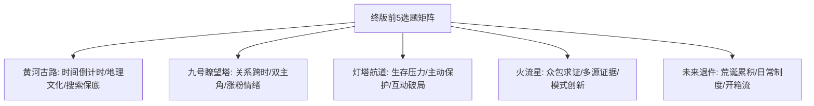

基于对 [主题前5.md](file:///c:/Users/72998/Desktop/%E4%BC%98%E5%8C%96%E7%89%88/7.27%E4%B8%8B/%E4%B8%BB%E9%A2%98%E5%89%8D5.md) 文件的完整审查，结合本轮5个AI产出的核心优势、已验证数据信号（FB-003搜索发酵、FB-005评论锚点、FB-006涨粉效率）、门禁去重规则及结构新鲜度，为您制作出 **最值得制作的前5名选题推荐次序** 及综合评估报告。

---

# 🏆 5大AI选题综合评估与推荐次序 Top 5

### 📊 推荐次序与战略分工总览

| 推荐位 | 主题名称 | 原AI产出来源 | 战略定位与主冲目标 | 主打互动/数据指标 | 综合推荐得分 |
| :--- | :--- | :--- | :--- | :--- | :---: |
| **Top 1** | **《黄河退水十二分钟，河床中央露出一条完整古路》** | 第1/4份 | **【高确定性·搜爆保底盘】** | 搜索发酵＋评论型 | **9.6 / 10** |
| **Top 2** | **《九号瞭望塔的对讲机，接到了十年前的火情》** | 第4/5份 | **【资产突破·情绪涨粉王】** | 高涨粉率＋评论型 | **9.4 / 10** |
| **Top 3** | **《暴风雨夜，退役灯塔组成了一条不存在的航道》** | 第1/2份 | **【互动破局·单变量实验】** | 转发型＋二选一讨论 | **9.1 / 10** |
| **Top 4** | **《三十七台行车记录仪，拼出一颗火流星的落点》** | 第3/4份 | **【模式创新·众包求证爽剧】** | 转发型＋结果兑现 | **9.0 / 10** |
| **Top 5** | **《物流中心连续收到来自2126年的退件》** | 第5/2份 | **【题材拉开·荒诞开箱流】** | 评论接龙＋社交货币 | **8.8 / 10** |

---

## 🔍 Top 5 选题深度评估与制作指南

### 🥇 Top 1：《黄河退水十二分钟，河床中央露出一条完整古路》
* **源自 AI 产出**：第1份（自然奇观）与第4份（高去重结构）合并重构
* **一句话故事**：汛期水文巡测队发现黄河水位无预警骤降12分钟，河床中央露出带有车辙与界桩的古代道路，必须在河水回归前完成完整测绘。

#### ⚖️ 六维评估矩阵
* **记录可信度（9.5）**：水情监控与无人机测绘天然具备拍摄与记录授权，无违和感。
* **三秒理解度（10.0）**：全民共知母题（黄河＋古路＋12分钟倒计时），**引导词预算趋零**。
* **中段留存力（9.5）**：水位快速变化＋倒计时硬时限，天然解决账号中段跳出流失问题。
* **情绪与涨粉（8.5）**：探索欲望＋文化敬畏，正向情绪覆盖面广。
* **结构新鲜度（8.5）**：去除了“古代军队显灵/归队仪式”，改为纯粹的历史地理测绘留存。
* **制作确定性（9.8）**：全批确定性最高，适合作为稳盘保底之作。

#### 💡 核心推荐理由与战略价值
1. **天然匹配已验证搜索发酵信号（FB-003）**：预埋“黄河古路显现事件”词条，可复制《长城烽火》84.3%来自单一搜索词的流量高爆发。
2. **极佳的视觉推进力**：水线下降 ➔ 界桩露出 ➔ 分叉呈现 ➔ 正射图拼合 ➔ 水流复覆盖，画面变化连续剧烈。

#### 🚨 Prompt 4 保护红线
> 严禁出现古代军队、节点点火、主角替历史完成使命；结尾必须落在测绘坐标留存，**绝对禁止使用数字与名单句式**。

---

### 🥈 Top 2：《九号瞭望塔的对讲机，接到了十年前的火情》
* **源自 AI 产出**：第4份（关系变化）与第5份（情绪完成）
* **一句话故事**：39岁护林员在九号塔值夜班时，对讲机接到了十年前另一名34岁护林员的火情报告，两人在隔空对话中共同复盘并影响了一场历史火情的局部走向。

#### ⚖️ 六维评估矩阵
* **记录可信度（8.8）**：岗位定时观测＋塔内录音系统，记录链清晰合法。
* **三秒理解度（9.0）**：跨时对讲规则简单直接，首行一句话即可完成设定交代。
* **中段留存力（9.2）**：关系推移＋“彼此何时意识到年代错位”悬念拉满。
* **情绪与涨粉（10.0）**：**全批情绪上限最高！** 继承《长城烽火》“泪点＋责任传承”的最高涨粉效率（2.3‰）。
* **结构新鲜度（9.2）**：账号首次采用“双主角关系”而非“人与现象”，打破奇观依赖。
* **制作确定性（9.0）**：空间集中在塔内与远处林海，制作成本相对可控。

#### 💡 核心推荐理由与战略价值
1. **突破账号涨粉瓶颈**：数据表明纯奇观不涨粉（《深海光缆》仅1.1‰），只有带“泪点/人性羁绊”才能高效转化粉丝。
2. **门槛最低的评论起头位（FB-005）**：置顶评论抛出“日志上第三种笔迹是谁”，极其容易引发自发评论与破圈裂变。

#### 🚨 Prompt 4 保护红线
> **两个人全程绝对不能见面！** 见面会退化成普通穿越剧；对讲内容留存影像须锁死为单一方案（录音/拍屏/日志三选一）；结尾用具体物件承接，禁用数字名单。

---

### 🥉 Top 3：《暴风雨夜，退役灯塔组成了一条不存在的航道》
* **源自 AI 产出**：第1份（生存型视觉发动机）
* **一句话故事**：远洋货轮在暴风雨中卫星导航失效，岸上退役灯塔发出旧灯语，海面上依次亮起早已沉没的旧灯塔，为货轮拼出一条地图上不存在的避险航道。

#### ⚖️ 六维评估矩阵
* **记录可信度（9.2）**：驾驶台监控、雷达界面、航标站日志三方互证，极其真实。
* **三秒理解度（9.5）**：暴风雨＋失效导航＋未知灯光，危机感一眼即懂。
* **中段留存力（9.0）**：生存压力＋每亮起一座灯塔就是一次重新决策，张力不断累加。
* **情绪与涨粉（8.8）**：紧张感转向被保护感与敬畏感。
* **结构新鲜度（9.0）**：将异常意图由“阻碍/破坏”颠覆为“主动保护”，结构差异明显。
* **制作确定性（8.8）**：重点控制在4~6座主灯塔，远景用光点表达，避免一致性崩溃。

#### 💡 核心推荐理由与战略价值
1. **单变量实验破局《深海光缆》**：《深海光缆》高点击高完播却死于互动率（0.02%），原因在于奇观无表达欲。本主题保留海洋工业视觉，把异常意图反转为保护，直接抛出**“换你，跟不跟”**的全民互动课题。

#### 🚨 Prompt 4 保护红线
> **不得过早确认灯塔是善意的！** 前中段必须保持“跟不跟”的悬疑张力；船长不能修复灯塔，不能点亮最后一座灯塔。

---

### 🏅 Top 4：《三十七台行车记录仪，拼出一颗火流星的落点》
* **源自 AI 产出**：第3份（众包证据）与第4份（高距离结构）
* **一句话故事**：夜空划过火流星，37台行车记录仪从不同视角拍下，网友自发在线拼合轨迹算出精确落点，并组队驱车进入荒原寻找实体。

#### ⚖️ 六维评估矩阵
* **记录可信度（9.8）**：**全账号记录链最短！** 行车记录仪＋网络帖子天然免解释流出链。
* **三秒理解度（9.5）**：天上掉东西＋网友算坐标＋现场寻找，极简事件句。
* **中段留存力（9.3）**：二值化期待（算得准不准/地上有没有），观众必须看到结尾。
* **情绪与涨粉（8.2）**：群体成就感＋搜寻爽感＋轻荒诞。
* **结构新鲜度（9.5）**：首次采用“众包群体主角”与“多源低码率影像分层”，视觉质感独特。
* **制作确定性（9.0）**：利用低码率画面与荒原实景落差，降低高精建模压力。

#### 💡 核心推荐理由与战略价值
1. **解决评论区信任悖论（F6）**：多源片段拼接极其契合互联网视听习惯，评论区天然产生“找茬/核对角度”的参与感。

#### 🚨 Prompt 4 保护红线
> **必须保护多源低画质的“未经整理感”！** 画面如果过于精致统一，可信度会瞬间归零；聚焦于“网友能干成事”的爽感，避免说教。

---

### 🏅 Top 5：《物流中心连续收到来自2126年的退件》
* **源自 AI 产出**：第5份（状态转化）与第2份（日常制度向）
* **一句话故事**：分拣线上连续出现标注为2126年的退件包裹，无寄件记录，里面装的都是当代正在被丢弃、但未来明确拒绝接收的普通物品。

#### ⚖️ 六维评估矩阵
* **记录可信度（9.0）**：仓库监控、扫描器记录、开箱登记，制度化留痕完整。
* **三秒理解度（9.2）**：未来退件包裹＋开箱好奇，大众认知零门槛。
* **中段留存力（9.0）**：逐件开箱结构，天然形成“下一件是什么”的连续期待。
* **情绪与涨粉（8.5）**：荒诞、好奇、轻微温柔不安。
* **结构新鲜度（9.5）**：全批唯一的“荒诞累积型故事发动机”，用极其正常的物流流程处理极大时间异常。
* **制作确定性（8.5）**：依赖物品反差与标签设计，不依赖大空间与复杂粒子。

#### 💡 核心推荐理由与战略价值
1. **极其优秀的社交货币与互动接龙**：适合在评论区抛出“下一件退回什么”，触发观众自发补全接龙，具有极高的分享属性。

#### 🚨 Prompt 4 保护红线
> 必须依靠“流程的极其正常”来烘托荒诞感，不能画风怪异；**严禁变成主角收到个人遗物、未来自己的信或说教合集**。

---

## 🛠️ 5大选题差异化协同矩阵

为了避免选题之间互相蚕食，这前5名选题在核心要素上实现了**两两互斥与全方位覆盖**：

* **冲搜索发酵/保底**：首选 **《黄河古路》**（极高确定性与认知底本）
* **冲粉丝增长/高涨粉**：首选 **《九号瞭望塔》**（情绪上限最高、情感回执）
* **冲评论/转发互动瓶颈**：首选 **《灯塔航道》**（二选一生存决策）
* **冲模式创新/可信度**：首选 **《火流星》**（众包证据与多源分层）
* **冲题材拉开/轻快感**：首选 **《未来退件》**（荒诞制度与开箱期待）

建议优先按照 **《黄河古路》 ➔ 《九号瞭望塔》 ➔ 《灯塔航道》** 的顺序进入 Prompt 4 分镜与解说创作。

2.## 综合推荐结论

这轮材料一共整合了5份AI评审、60个候选主题和近期4部核心作品的数据及结构去重档案，信息量已经足够做一次相对可靠的制作排序。

我先按“第1名3分、第2名2分、第3名1分”统计五份推荐，再结合**近期作品数据、结构新鲜度、涨粉能力、平台风险和AI连续出图难度**进行二次修正。

### 五份AI的推荐共识

| 主题       | 入选次数 | 原始排名积分 | 综合判断             |
| -------- | ---: | -----: | ---------------- |
| 黄河退水古路   |   3次 |     9分 | 三次入选全部是第1名       |
| 灯塔航道     |   4次 |     7分 | 入选覆盖面最广          |
| 九号瞭望塔    |   3次 |     6分 | 情绪和涨粉能力最强        |
| 火流星三十七角度 |   3次 |     4分 | 评论、转发和结构创新最强     |
| 罗布泊测绘站   |   1次 |     3分 | 单份AI强推，但多数评审否决   |
| 盐池旧海岸    |   1次 |     1分 | 共识较弱，但风险和制作稳定性优秀 |

据此，**最值得制作的前5名**是：

---

# 第1名：《黄河退水十二分钟，河床中央露出一条完整古路》

## 为什么排第一

这是五份AI中**排名稳定性最高**的主题：三份AI把它放在第一名，没有任何一份将它列入立即开发时放在第二或第三。第一、第三和第五份评审都将其作为保底方向，认为它兼具公共母题、倒计时、事件化命名、明确回报和搜索发酵能力。  

它也是目前最贴合你实际数据的主题：

* 《长城烽火》已经证明了**共知文化母题＋清楚事件句＋正向情绪＋事实结果**有效。
* “黄河突然退水十二分钟，露出一条古路”几乎不需要解释。
* 十二分钟是天然的中段发动机，不容易出现“前面有钩子，中段只剩参观”的问题。
* 黄河、古路、河床和测绘，兼顾年轻观众的奇观兴趣，也能承接24—40岁观众的文化情绪。
* 标题很容易形成搜索词：**“黄河古路显现事件”**。

## 最大优势

它不是单纯画面漂亮，而是每隔几张都可以兑现新答案：

水位退去 → 车辙出现 → 界桩出现 → 道路分叉 → 与现代地图冲突 → 终点显露 → 河水回归。

## 主要风险

最大的风险不是平台，而是**再次写成长城结构**。绝不能出现古代军队、历史人物返回、主角补完最后一步、名单或归队仪式。高潮应该是道路身份和完整坐标被确认。

**定位：基础播放、搜索发酵和文化方向的首要保底作品。**

---

# 第2名：《暴风雨夜，退役灯塔组成了一条不存在的航道》

## 为什么排第二

这是五个AI中**入选次数最多**的主题，共有四份放入立即开发前三，分别位列第二、第二、第二和第三。   

它对《深海光缆》的改进非常精准：

* 保留海洋工业影像、恶劣环境和设备记录带来的点击能力；
* 删除“寻找接口、完成修复”的旧发动机；
* 将异常从阻碍者改成保护者；
* 增加一个所有观众都能回答的问题：**“换成你，跟不跟？”**

相比黄河，它的搜索文化属性稍弱，但在**首图冲击、完播张力、评论和转发**上可能更强。

## 最大优势

它具备真正持续存在的现实选择：

* 第一座灯塔出现，可能是巧合；
* 第二座与雷达冲突，开始可疑；
* 船只选择跟随；
* 航道却偏离港口；
* 看似平静的海域被绕开；
* 后方海况证明那片区域确实危险；
* 最终安全驶出。

这种“每亮一座灯塔，都要重新判断一次”的机制，比一路接近某个巨物更能撑住中段。

## 主要风险

不能太早证明灯塔是善意的。前三分之一就确认“它们一定在救船”，后面会立刻失去张力。灯塔数量也应控制在四至六座主灯塔，避免连续性和空间关系失控。

**定位：高点击、高转发，并修复《深海光缆》互动不足问题的重点作品。**

---

# 第3名：《九号瞭望塔的对讲机，接到了十年前的火情》

## 为什么排第三

三份AI将它放入立即开发前三，排名分别是第一、第三和第二。它不是最大的视觉奇观，却被反复认为是**本轮情绪上限最高、最可能提升涨粉效率**的主题。  

你的现有数据已经透露出一个明显问题：

* 奇观能够拉点击和浏览；
* 但真正明显带来涨粉的，仍然是带人物、情绪和回报的作品。

九号瞭望塔正好承担这个功能。它保留《长城烽火》中有效的“责任感＋事实回执”，但把故事从宏大军阵压缩成两个从未见面的普通成年值班员，结构气质会明显不同。

## 最大优势

它的观看欲望不是“还能出现什么更大的东西”，而是：

* 对讲机另一端是谁？
* 两个人什么时候意识到相隔十年？
* 今天的人能不能把信息传给过去？
* 十年前的火情最后发生了什么？
* 现实中会不会留下某件物证？

关系确认型悬念通常比单纯奇观扩大更持久，也更容易产生评论和粉丝记忆。

## 主要风险

视觉空间较窄，主要在瞭望塔、林海、日志和无线电设备之间切换，Prompt 4必须设计好两个年份的天气、林相、火线和证据变化。

此外要严格保护两条红线：

1. 两个人始终不能真正见面；
2. 结尾不能再用数字、名单、点名或集体致敬，应由一件具体物件或日志痕迹完成回执。

**定位：专门冲情绪、评论和涨粉资产的作品。**

---

# 第4名：《三十七台行车记录仪，拼出一颗火流星的落点》

## 为什么排第四

三份AI将它列入立即开发，排名分别为第三、第三和第二。虽然原始积分低于前三，但它是所有主题中**结构距离最大、记录可信度最高、评论机制最天然**的一个。  

它能够一次性打破你近期作品的多条惯性：

* 不再是单一工程人员；
* 不再是一台设备线性推进；
* 不再是人造旧系统自行运行；
* 不再依赖历史遗迹或私人创伤；
* 主角变成互不认识的普通网友；
* 证据从低画质片段逐渐汇聚成真实坐标。

## 最大优势

它几乎天然解决评论区“点开了但不知道说什么”的问题。

可以预埋非常具体的互动锚点：

* 第17号记录仪的角度为什么对不上？
* 计算落点为什么偏了三公里？
* 坑边的车辙是谁留下的？
* 某一段记录为什么找不到上传者？

观众不需要理解隐喻，也不需要代入人生经验，只需要参与找证据和猜结果，特别适合你目前30岁以下占比较高的受众。

## 主要风险

这个主题最怕画面过于统一、精致。三十七台记录仪必须呈现不同时间码、不同码率、不同挡风玻璃、不同天气和不同拍摄角度。做得太漂亮，反而会失去伪纪实可信度。

它的情绪回报弱于九号瞭望塔，因此排第四，而不是第三。

**定位：冲评论、转发和年轻受众扩圈的结构创新作品。**

---

# 第5名：《盐池每夜重画一条已经消失的海岸线》

## 为什么排第五

单纯按照推荐积分，第五本应是《罗布泊干涸线3号测绘站》。但综合评估后，我建议将罗布泊剔除，让盐池旧海岸进入第五。

原因是罗布泊虽然被一份AI列为第一，却被其他多份评审明确判断为：

* 与《长城烽火》的历史奉献、旧岗位、当代确认和情绪回执过近；
* 点云恢复历史人员、胸卡或牺牲现场，存在死亡等价呈现和平台风险；
* 容易形成“换地点、换设备，但还是同一种历史使命被补完”的结构换皮。第五份评审甚至将其作为门禁14和平台风险案例整题淘汰。

盐池旧海岸虽然只被一份AI放进前三，但它有几个很重要的长期价值：

* 与近期所有作品结构距离高；
* 没有军事、失踪、死亡、讽刺和社会负面风险；
* 盐晶从局部纹路逐夜拼成巨大旧海岸，视觉机制独特；
* 制作成本和人物一致性压力低；
* 很适合收藏、二刷和地图位置讨论；
* 可以测试纯地理奇观，不依赖历史人物返回是否仍然有效。

第一份评审特别指出，它能够以“单一平面上的物质连续生长”替代《长城烽火》的节点激活，而且制作成本明显低于多人物、大遗迹和复杂镜面主题。

## 为什么只排第五

它的问题也很明确：

* 生存压力弱；
* 人物关系弱；
* 每晚只是“盐纹又长了一点”会非常容易重复；
* 白色盐池场景可能导致画面层次单调；
* 标题冲击力暂时弱于前四名。

必须让每一晚新增的是**不同地理答案**，而不仅是面积变大，例如先出现海湾、再出现岬角、旧港口、河口和一处现实中不存在的岛形。

**定位：低风险、低同质化的视觉实验和账号题材扩展作品。**

---

# 最终制作顺序

建议实际生产时就按照这个顺序推进：

1. **黄河退水古路**——先做确定性最高的保底作品；
2. **灯塔航道**——紧接着测试保护型异常和互动能力；
3. **九号瞭望塔**——补充人物情感，重点冲涨粉；
4. **火流星三十七角度**——彻底换结构，冲年轻用户评论和转发；
5. **盐池旧海岸**——作为低风险视觉实验，拓宽账号母题。

这个次序并不是简单把五个“最高分题材”排在一起，而是形成一组完整的账号测试矩阵：

* 黄河负责**搜索与文化收口**；
* 灯塔负责**点击、紧张和转发**；
* 瞭望塔负责**情绪与涨粉**；
* 火流星负责**评论与年轻受众扩圈**；
* 盐池负责**题材去重和视觉风格扩展**。

**暂不建议制作：《罗布泊干涸线3号测绘站》。**它不是概念不够好，而是现阶段离《长城烽火》的高权重结构太近。此时再做，很可能强化账号只有“历史岗位＋旧系统＋使命回执”这一种能力的印象。

最终选择
《黄河退水十二分钟，河床中央露出一条完整古路》

### 1. 一句话故事种子

一支由成年水文工程师组成的汛期巡测队发现，黄河水位在没有上游调度的情况下突然退去十二分钟，河床中央露出一条带有车辙、界桩和分叉的古代道路。

### 2. 主要叙事承诺

观众等待古路通向哪里，以及巡测队能否在河水回归前留下完整坐标和证据。

### 3. 主要故事发动机

时间推进为主；信息揭示为辅。

### 4. 主角功能

调查者／记录者，绿灯。

巡测队只能测量、取证、撤离和上报，不能控制水位或古路。

### 5. 核心观看欲望

在十二分钟结束前看清整条道路的终点。

### 6. 主要情绪

探索、文化敬畏、有限度的荣耀感。

### 7. 记录方案

* **拍摄者**：成年水文工程师与固定水情监控系统；
* **记录动机**：异常退水属于必须立即上报的重大水情；
* **设备**：水情摄像头、测绘无人机、工程手机、浅地层探测仪；
* **外流链**：影像作为联合水情调查附件，脱敏后随调查通报公开。

### 8. 异常独立性

古路在主角抵达前已经埋于河床，与任何人的私人记忆、遗憾或愿望无关。

### 9. 视觉发动机

水线快速下降、河床范围扩大、界桩逐个显露、道路分叉、无人机正射图逐步拼合，以及河水重新覆盖。

### 10. 故事生长点

撤离倒计时、地图冲突、道路年代差异、现代城市方位、终点结构和上游水情均可继续生长。

### 11. 可发展的方向

* 古路连接两处史料中从未相通的渡口；
* 所有车辙都朝向一座现代城市；
* 终点是一处始终保持干燥的候渡台。

### 12. 潜在回报类型

完整空间确认；历史地理解释；永久坐标留存。

### 13. 与近期作品的结构距离

中高。

虽共享历史文化母题，但没有节点点亮、古代群体返回、主角完成系统使命或集体归队。

### 14. 与本轮其他主题的差异

唯一以“极短自然时间窗＋完整道路测绘”为核心的主题。

### 15. 风险提示

水位连续性为主要制作难点