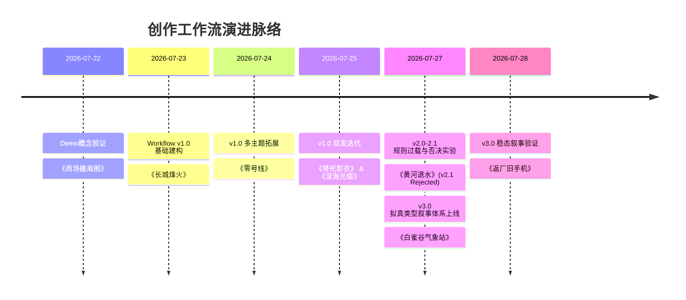

# 创作工作流演进与作品试验时间线 (Workflow & Works Timeline)

本文档记录了 AI 拟真连续图片叙事工作流从 1.0 雏形构建到 3.0 体系化验证的完整迭代历程与对应产出的作品试验档案。

---

## 📅 演进总览与时间线 (Timeline Overview)

---

## 🚀 阶段版本详述 (Version Breakdown)

### Phase 0: Demo 概念验证阶段 (2026-07-22)
* **对应工作流**：无固定 Prompt，手动探求“现实入口 + 异常介入”创作模式。
* **代表作品**：[works/2026-07-22-demo-商场撤离图](works/2026-07-22-demo-商场撤离图/)
* **关键结论**：验证了“现实入口＋异常介入＋连续图片叙事”的内部创作可行性，并暴露了分镜数量、视觉承接和故事定位等初期问题。

---

### Phase 1: Workflow v1.0 — 基础三段式结构 (2026-07-23 ~ 2026-07-25)
* **对应工作流**：[workflow/v1.0/](workflow/v1.0/)
* **核心特征**：
  * 建立 Prompt3 (选题)、Prompt4 (故事)、Prompt5 (分镜/生图) 链式体系。
  * 引入“入口信用、求证递进、视觉发动机、情绪回报、AI可控性”五大评估维度。
* **代表作品**：
  1. 2026-07-23：[works/2026-07-23-v1.0-长城烽火](works/2026-07-23-v1.0-长城烽火/) （《长城烽火一夜全亮，失踪两千年的军队回来了》）
  2. 2026-07-24：[works/2026-07-24-v1.0-零号线](works/2026-07-24-v1.0-零号线/) （《零号线：下一站，忘记》）
  3. 2026-07-25：[works/2026-07-25-v1.0-替死影衣](works/2026-07-25-v1.0-替死影衣/) （中式民俗/水库空棺）
  4. 2026-07-25：[works/2026-07-25-v1.0-深海光缆](works/2026-07-25-v1.0-深海光缆/) （《全球断网第3小时，我在万米海底找到了一只抓着光缆的石手》）

---

### Phase 2: Workflow v2.0 & v2.1 — 机制探索与否决复盘 (2026-07-27)
* **对应工作流**：
  * [workflow/v2.0-transition/](workflow/v2.0-transition/)
  * [workflow/v2.1-rejected/](workflow/v2.1-rejected/)
* **核心特征**：
  * v2.0 尝试引入多方案竞演与融合审查机制。
  * v2.1 过于追求硬核民俗与复杂的约束法则，导致认知过载与缺乏直观情绪回报。
* **否决作品**：
  * 2026-07-27：[works/2026-07-27-v2.1-rejected-黄河退水](works/2026-07-27-v2.1-rejected-黄河退水/) （《黄河退水十二分钟》——因门禁过载、第二规则冲突被否决）
* **关键复盘**：见 [workflow/v2.1-rejected/failure-review.md](workflow/v2.1-rejected/failure-review.md)。

---

### Phase 3: Workflow v3.0 — 拟真类型叙事与多维门禁 (2026-07-27 ~ 至今)
* **对应工作流**：[workflow/v3.0-current/](workflow/v3.0-current/)
* **核心特征**：
  * 引入“跨文件合同与术语表”、“离线回归测试”、“删改审计”等标准审查规则。
  * 拓宽至“拟真类型叙事”，强化人物能动性、变轨情绪与结构距离，避免界面堆叠与静态叙事。
* **代表作品**：
  1. 2026-07-27：[works/2026-07-27-v3.0-白雀谷气象站](works/2026-07-27-v3.0-白雀谷气象站/) （《白雀谷天气分界事件》）
  2. 2026-07-28：[works/2026-07-28-v3.0-返厂旧手机](works/2026-07-28-v3.0-返厂旧手机/) （《格式化之前，这批旧手机把没发出去的话说完了》）
