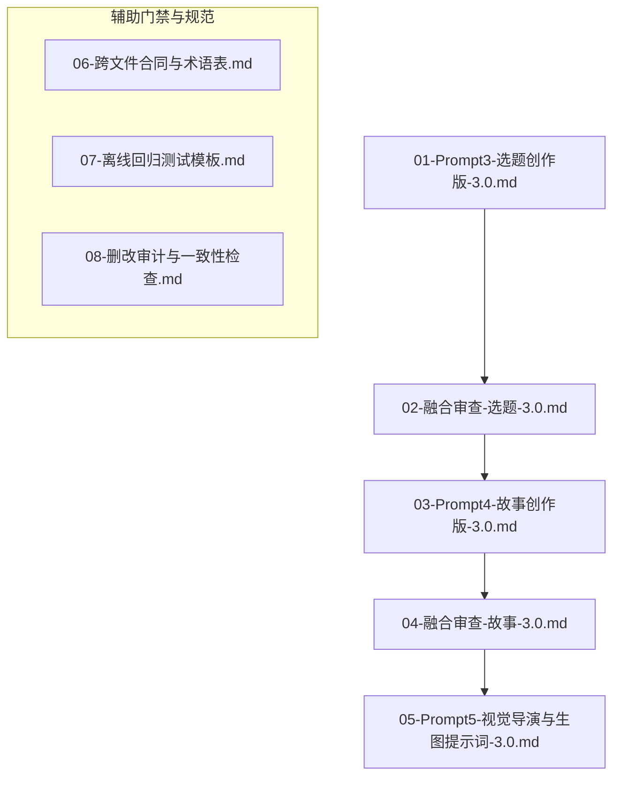

# Workflow v3.0 当前工业化工作流说明

## 简介
Workflow v3.0 是目前正在使用的最新版工业化爆款生产线体系。引入了严格的门禁测试、跨文件合同与术语表、离线回归测试以及删改审计，彻底打通了从选题策划到高质量生图提示词的全链路。

## 核心流程与提示词文件

## 关键文档清单
- [00-工作流3.0-使用说明与改进逻辑.md](prompts/00-工作流3.0-使用说明与改进逻辑.md)
- [01-Prompt3-选题创作版-3.0.md](prompts/01-Prompt3-选题创作版-3.0.md)
- [02-融合审查-选题-3.0.md](prompts/02-融合审查-选题-3.0.md)
- [03-Prompt4-故事创作版-3.0.md](prompts/03-Prompt4-故事创作版-3.0.md)
- [04-融合审查-故事-3.0.md](prompts/04-融合审查-故事-3.0.md)
- [05-Prompt5-视觉导演与生图提示词-3.0.md](prompts/05-Prompt5-视觉导演与生图提示词-3.0.md)
- [06-跨文件合同与术语表.md](prompts/06-跨文件合同与术语表.md)
- [07-离线回归测试模板.md](prompts/07-离线回归测试模板.md)
- [08-删改审计与一致性检查.md](prompts/08-删改审计与一致性检查.md)
- [底层逻辑研究结论.md](prompts/底层逻辑研究结论.md)

## 代表作品
- [works/2026-07-27-v3.0-白雀谷气象站](../../works/2026-07-27-v3.0-白雀谷气象站/)
- [works/2026-07-28-v3.0-返厂旧手机](../../works/2026-07-28-v3.0-返厂旧手机/)
